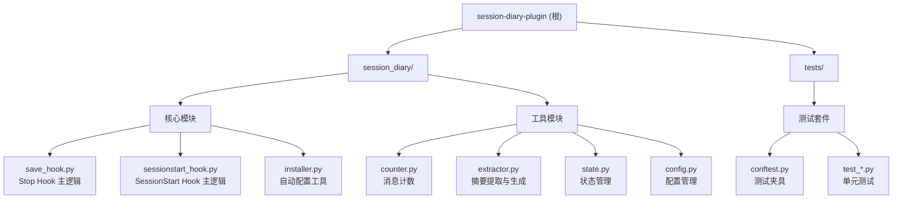

# Session Diary Plugin

> Lightweight session diary hooks for Claude Code - zero dependencies, zero vector DB

## 项目愿景

提供一个轻量级的 Claude Code 会话记忆插件，通过 Stop 和 SessionStart hooks 自动保存和注入会话日记到本地项目目录。相比 MemPalace 等重型方案，本插件零依赖、零资源占用、零配置烦恼。

## 架构总览

```
Claude Code Hook 机制
    ├── Stop Hook（会话结束时触发）
    │   └── 每 N 条消息 + 时间间隔双重条件触发保存
    │       ├── 计数消息数
    │       ├── 提取历史摘要
    │       ├── 生成当前条目
    │       ├── 增量累积并裁剪（30KB 限制）
    │       └── 写入 Markdown 日记文件
    │
    └── SessionStart Hook（新会话开始时触发）
        └── 读取最新日记文件
            ├── 提取历史任务摘要
            ├── 提取最近进展
            └── 注入到系统提示词

安装配置工具
    └── session-diary-install
        └── 自动检测并配置 Claude Code settings.json
```

## 模块结构图



## 模块索引

| 模块路径 | 职责 | 语言 | 入口文件 | 测试覆盖 |
|---------|------|------|---------|---------|
| `session_diary/` | 核心插件包，提供 hooks 和安装工具 | Python 3.8+ | `__init__.py` | ✅ 完整覆盖 |
| `tests/` | 单元测试套件 | Python | `conftest.py` | - |

## 运行与开发

### 安装

```bash
# 1. 使用 uv tool 安装
uv tool install session-diary-plugin

# 2. 验证安装
uv tool list

# 3. 自动配置 Claude Code
session-diary-install

# 4. 重启 Claude Code 激活 hooks
```

### 开发环境

```bash
# 克隆仓库
git clone <repo-url>
cd session-diary-plugin

# 创建虚拟环境（Python 3.14）
uv venv --python 3.14

# 激活虚拟环境
source .venv/bin/activate  # Linux/macOS
# 或 .venv\Scripts\activate  # Windows

# 安装开发依赖
uv pip install -e ".[dev]"
```

### 运行测试

```bash
# 运行所有测试
pytest

# 运行测试并查看覆盖率
pytest --cov=session_diary --cov-report=term-missing

# 覆盖率要求：>= 80%
```

### 本地测试 Hook

```bash
# 测试 Stop Hook
echo '{"session_id":"test","stop_hook_active":false,"transcript_path":"/tmp/test.jsonl"}' | session-diary-save-hook

# 测试 SessionStart Hook
session-diary-sessionstart-hook

# 测试安装工具
session-diary-install
```

## 配置

### 环境变量

- `SESSION_DIARY_SAVE_INTERVAL=30` - 保存间隔（消息数，默认 30）
- `SESSION_DIARY_MIN_INTERVAL=60` - 最小时间间隔（分钟，默认 60）
- `SESSION_DIARY_VERBOSE=false` - 详细模式（默认关闭）
- `SESSION_DIARY_MEMORY_DIR=.session-memory` - 日记目录（默认 .session-memory）
- `SESSION_DIARY_STATE_DIR=~/.session-diary/hook_state` - 状态目录

### settings.local.json 配置

支持两种配置格式：

```json
// 格式 1：嵌套对象
{
  "sessionDiary": {
    "directory": ".session-memory"
  }
}

// 格式 2：简单字符串
{
  "sessionDiaryDirectory": ".session-memory"
}
```

## 测试策略

- **测试框架**：pytest + pytest-cov
- **覆盖率要求**：>= 80%
- **测试类型**：
  - 单元测试：每个模块的核心功能
  - 集成测试：完整的 hook 流程
  - 边缘情况：错误处理、格式兼容性
- **测试夹具**：`conftest.py` 提供共享测试数据
- **向后兼容**：测试覆盖新旧 diary 格式

## 编码规范

- **Python 版本**：>= 3.8
- **代码风格**：遵循 PEP 8
- **依赖管理**：零第三方依赖，仅使用标准库
- **类型提示**：使用 Python 类型注解
- **错误处理**：优雅降级，避免崩溃
- **日志记录**：写入 `~/.session-diary/hook_state/hook.log`

## AI 使用指引

### 项目特点

1. **零依赖**：仅使用 Python 标准库，无第三方包
2. **轻量级**：纯文本 Markdown 存储，无向量数据库
3. **自动配置**：一键安装并配置 Claude Code hooks
4. **向后兼容**：自动识别新旧 diary 格式
5. **增量摘要**：30KB 大小控制，自动裁剪旧条目

### 关键文件

- `session_diary/save_hook.py` - Stop Hook 主逻辑（触发保存）
- `session_diary/sessionstart_hook.py` - SessionStart Hook 主逻辑（注入记忆）
- `session_diary/extractor.py` - 摘要提取与生成逻辑
- `session_diary/config.py` - 配置管理与路径解析
- `session_diary/state.py` - Hook 状态持久化
- `session_diary/counter.py` - 消息计数（过滤命令消息）

### Hook 触发机制

**Stop Hook 双重条件**：
1. 消息数条件：`exchange_count - last_save >= SAVE_INTERVAL`
2. 时间条件：`minutes_since_last >= MIN_SAVE_INTERVAL_MINUTES`
3. 两个条件同时满足才触发保存

**SessionStart Hook**：
- 读取最新 diary 文件
- 提取"历史任务摘要"和"本次进展"
- 输出格式化文本注入系统提示词

### Diary 文件格式

```
.session-diary-YYYY-MM-DD-HHMM.md

# Session Diary - YYYY-MM-DD HH:MM

## 历史任务摘要（截止本次会话）

### YYYY-MM-DD HH:MM Task Title
- **成果：** ...
- **决策：** ...

---

## 本次进展

### Task Title
...

## 关键发现

- Finding 1
- Finding 2

## 关键决策

**决策 1: Decision Title**
- Reason
```

### 常见问题

1. **Q: Hook 没有触发？**
   - 检查 settings.json 配置是否正确
   - 确认已重启 Claude Code
   - 查看 `~/.session-diary/hook_state/hook.log`

2. **Q: 日记文件在哪里？**
   - 默认：项目根目录下的 `.session-memory/`
   - 可通过环境变量或 settings.local.json 自定义

3. **Q: 如何调试？**
   - 设置 `SESSION_DIARY_VERBOSE=true` 启用详细模式
   - 查看 hook.log 日志文件
   - 使用 pytest 运行测试

## 变更记录 (Changelog)

### 2026-05-07 - 定期更新 AI 上下文

- 执行阶段 A：全仓清点（100% 文件覆盖）
- 执行阶段 B：模块优先扫描（8 源文件 + 7 测试文件）
- 验证文档完整性：根级和模块级 CLAUDE.md 已存在
- 更新 index.json 时间戳为 2026-05-07T12:36:00+0800
- 更新配置默认值：SAVE_INTERVAL=30, MIN_INTERVAL=60
- 覆盖率报告：100%（8/8 源文件 + 7/7 测试文件）
- 扫描状态：完整覆盖，无需补捞

### 2026-05-05 - 初始化 AI 上下文

- 生成根级 CLAUDE.md 文档
- 生成模块级 CLAUDE.md 文档
- 创建 .claude/index.json 索引
- 扫描覆盖率：100%（8/8 源文件 + 7/7 测试文件）